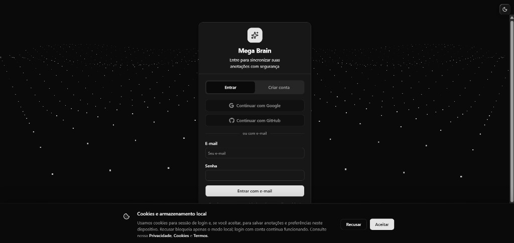
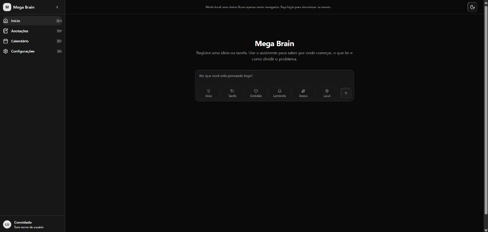
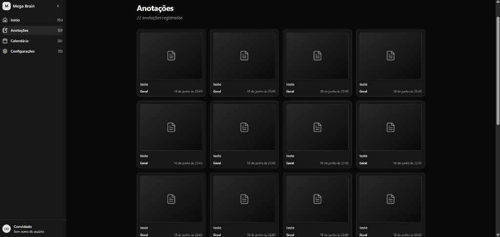
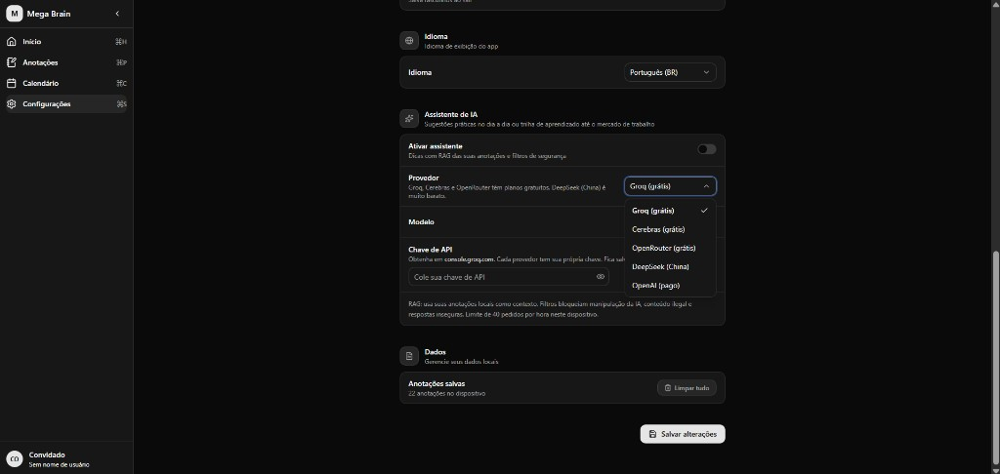
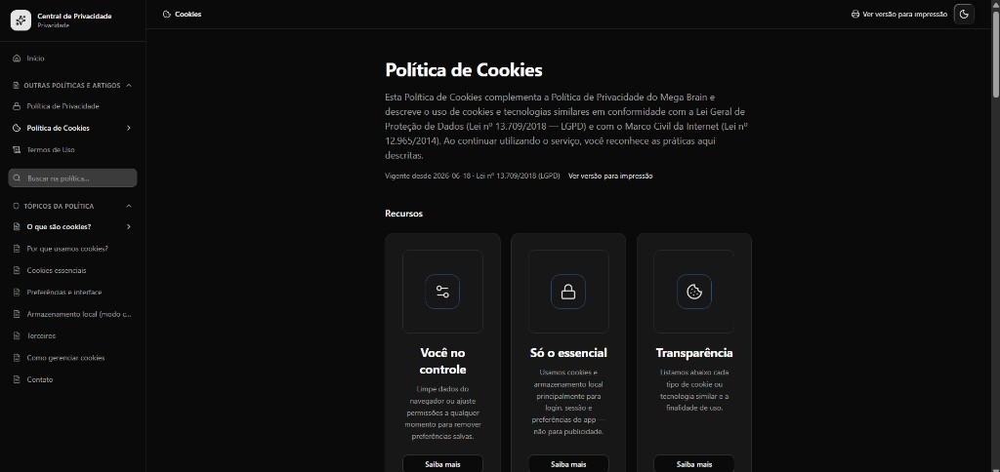
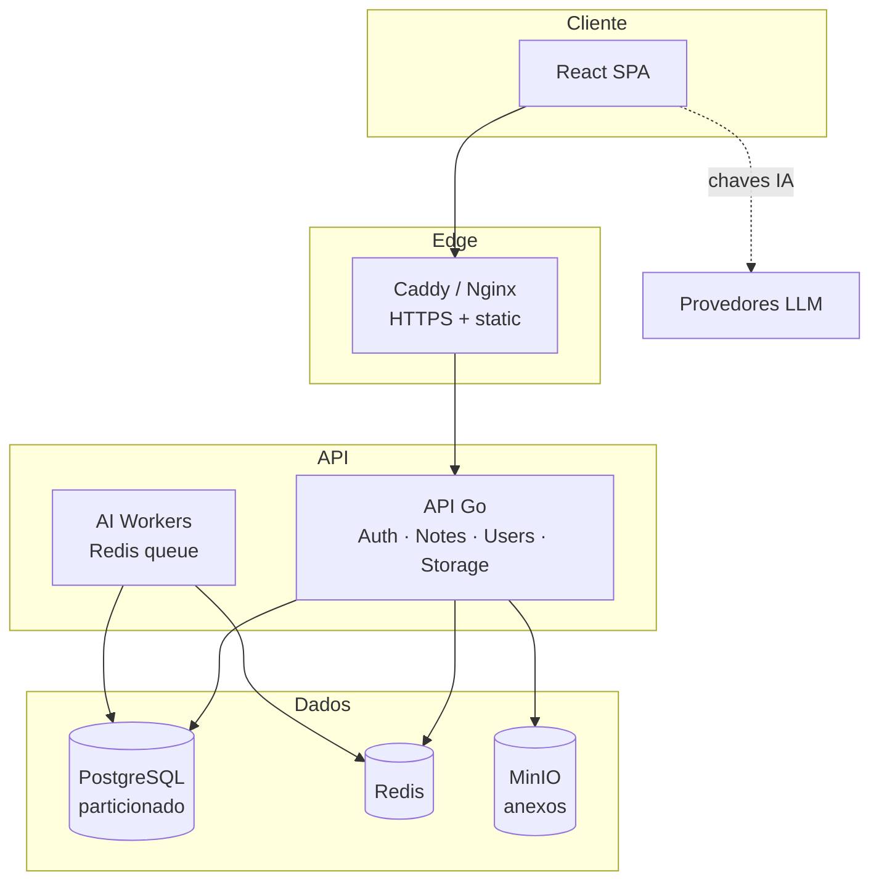

<div align="center">

# Mega Brain

**Plataforma full-stack de anotações pessoais com IA contextual, geolocalização e conformidade LGPD.**

*Personal knowledge app with contextual AI, geolocation, and LGPD-compliant privacy controls.*

[](https://react.dev/)
[](https://www.typescriptlang.org/)
[](https://go.dev/)
[](https://www.postgresql.org/)
[](https://www.docker.com/)
[]()

[Repositório](https://github.com/soninhoxs/boloco-de-notas-inteligente) · [Segurança](docs/SECURITY.md) · [Deploy](docs/DEPLOY_MEGABRAIN.md)

<br />



*Login com Google/GitHub, consentimento LGPD e visual minimalista em dark mode.*

</div>

---

## Sobre o projeto

O **Mega Brain** é um produto completo para capturar, organizar e evoluir ideias e tarefas do dia a dia. O usuário registra pensamentos com tags semânticas, anexos e localização; o assistente de IA sugere próximos passos com base no **histórico real de anotações** (RAG), não em respostas genéricas.

O projeto foi pensado como **aplicação de produção**: autenticação multi-provedor, sincronização na nuvem, políticas de privacidade, exportação/exclusão de dados (LGPD) e infraestrutura containerizada pronta para escalar.

### Problema

Ferramentas de notas costumam ser ou muito simples (sem contexto) ou muito complexas (sem privacidade clara). Usuários brasileiros precisam de uma solução que respeite a LGPD, funcione offline/localmente quando desejado e ofereça IA útil sem expor dados desnecessariamente.

### Solução

- **Modo convidado** — dados apenas no navegador, com consentimento explícito de cookies.
- **Modo conta** — sync seguro via API REST, sessões httpOnly, CSRF e MFA opcional.
- **IA sob demanda** — RAG sobre as próprias notas; chaves de API ficam no cliente; filtros de conteúdo inseguro.
- **Deploy flexível** — dev local, stack no notebook (Docker) ou produção em VPS com HTTPS automático.

---

## Design, UX e UI

O Mega Brain foi desenhado como um **produto digital completo**, não apenas como protótipo técnico. A interface prioriza foco, legibilidade e fluxos curtos — do pensamento à ação.

### Princípios de design

| Princípio | Na prática |
|-----------|------------|
| **Clareza** | Hierarquia tipográfica forte, labels explícitos e textos de apoio onde a ação não é óbvia |
| **Foco** | Área central dedicada à captura de ideias; navegação lateral discreta |
| **Confiança** | Banner de modo local, Central de Privacidade navegável e consentimento antes de cookies/IA |
| **Consistência** | Design system com tokens CSS, componentes reutilizáveis (shadcn/Base UI) e ícones Lucide |
| **Acessibilidade** | Contraste em dark mode, `aria-label` em ações icônicas, foco visível em controles |

### Design system

- **Tema claro/escuro** com toggle persistente e variáveis semânticas (`background`, `foreground`, `muted`, `primary`)
- **Componentes** — cards com bordas suaves, inputs com estados de foco, switches e selects padronizados
- **Motion** — animações leves no grid masonry e transições na sidebar (Framer Motion)
- **Microcopy** — tom direto em pt-BR e en-US via i18n; placeholders neutros sem dados fictícios
- **Login** — superfície pontilhada 3D (Three.js) como identidade visual sem poluir o formulário

### Fluxos principais de UX

1. **Captura** — composer com tags semânticas (ideia, tarefa, gratidão, lembrete) + anexo e mapa em um único fluxo
2. **Revisão** — grid masonry nas anotações com leitura escaneável e detalhe sob demanda
3. **Configuração** — settings em cards agrupados (conta, perfil, aparência, IA, dados)
4. **Privacidade** — políticas com busca, índice lateral e cards de destaque (não apenas texto jurídico)

---

## Versão mobile e responsividade

O app é **mobile-first na experiência**: funciona no celular via navegador (PWA-ready) com os mesmos fluxos do desktop.

| Comportamento | Desktop | Mobile / tablet |
|---------------|---------|-----------------|
| **Navegação** | Sidebar fixa, colapsável (`lg+`) | Menu hambúrguer + drawer com overlay (`< lg`) |
| **Composer** | Tags em grade horizontal | Botões touch-friendly empilhados em telas estreitas |
| **Notas** | Grid masonry multi-coluna | Colunas reduzidas automaticamente; scroll vertical fluido |
| **Configurações** | Cards em largura confortável (`max-w-2xl`) | Mesma hierarquia, padding adaptativo (`px-6`) |
| **Login** | Card centralizado sobre fundo animado | Formulário em coluna única, botões OAuth em largura total |

**Breakpoint principal:** sidebar e layout amplo a partir de `1024px` (`lg`); hook `useIsMobile` em `768px` para componentes que exigem comportamento específico.

**Teste no celular:** rode `.\scripts\expose-megabrain-notebook.ps1` e abra o link HTTPS gerado — qualquer pessoa pode testar sem instalar app.

---

## Galeria de telas

<p align="center">
  
  <br /><br />
  <em><strong>Início</strong> — captura de ideias com tags, assistente de IA e modo convidado</em>
</p>

<p align="center">
  
  <br /><br />
  <em><strong>Anotações</strong> — grid masonry animado com categorias e data</em>
</p>

<p align="center">
  
  <br /><br />
  <em><strong>Configurações · IA</strong> — provedores, modelos, chave no cliente e consentimento RAG</em>
</p>

<p align="center">
  
  <br /><br />
  <em><strong>Central de Privacidade</strong> — políticas LGPD com busca, índice e cards explicativos</em>
</p>

<p align="center">
  
  <br /><br />
  <em><strong>Login</strong> — OAuth, e-mail/senha e banner de cookies</em>
</p>

---

## Destaques técnicos

| Área | Implementação |
|------|----------------|
| **Frontend** | React 19, TypeScript, Vite, Tailwind, MapLibre GL, i18n (pt-BR / en-US), design responsivo |
| **Backend** | Go, Gin, JWT + refresh token rotation, OAuth (Google/GitHub) |
| **Dados** | PostgreSQL particionado, PgBouncer, Redis (cache/filas), MinIO (anexos) |
| **IA** | Workers assíncronos, múltiplos provedores (Groq, OpenAI, DeepSeek), validação de segurança |
| **Privacidade** | LGPD: consentimento versionado, export JSON, exclusão em cascata, políticas integradas |
| **DevOps** | Docker Compose (dev/notebook/prod), Caddy + TLS, manifests Kubernetes, CI de segurança |
| **Qualidade** | Vitest no frontend, ESLint, migrations SQL versionadas |

---

## Arquitetura



---

## Funcionalidades

### Produto
- Composer de notas com tags (ideia, tarefa, gratidão, lembrete)
- Anexos (imagem/PDF) e picker de localização com mapa
- Calendário com heatmap de atividade
- Grid masonry animado na listagem de notas
- Tema claro/escuro, atalhos de teclado, **layout responsivo desktop e mobile**

### Conta e segurança
- Cadastro com verificação de e-mail
- Login social (Google, GitHub) e credenciais locais
- MFA (TOTP), troca de e-mail, revogação de sessões
- CSRF em mutações, cookies httpOnly, rate limiting

### IA
- Sugestões contextuais para ideias e tarefas
- RAG: recuperação das notas mais relevantes antes do prompt
- Moderação de conteúdo e consentimento específico para envio a terceiros

---

## Stack

**Frontend** — React 19 · TypeScript · Vite · React Router 7 · Tailwind CSS · Framer Motion · MapLibre GL · cmdk

**Backend** — Go · Gin · PostgreSQL 16 · PgBouncer · Redis 7 · MinIO · SMTP

**Infra** — Docker · Caddy · GitHub Actions · Kubernetes (manifests)

---

## Como executar

### Pré-requisitos

- Node.js 20+
- Docker Desktop (para stack completa)
- [cloudflared](https://developers.cloudflare.com/cloudflare-one/connections/connect-networks/downloads/) (opcional, para expor testes)

### Frontend apenas (desenvolvimento)

```bash
git clone https://github.com/soninhoxs/boloco-de-notas-inteligente.git
cd boloco-de-notas-inteligente/app
npm install
npm run dev
```

→ http://localhost:5173

### Stack completa no notebook (Windows)

```powershell
.\scripts\start-megabrain-notebook.ps1
```

→ http://localhost:3080 (frontend + API + banco + storage)

### Link público temporário (testes com outras pessoas)

```powershell
winget install Cloudflare.cloudflared
.\scripts\expose-megabrain-notebook.ps1
```

### Produção (VPS + domínio)

Ver [docs/DEPLOY_MEGABRAIN.md](docs/DEPLOY_MEGABRAIN.md).

### Variáveis de ambiente

| Arquivo | Descrição |
|---------|-----------|
| [app/.env.example](app/.env.example) | API URL, estilo de mapa |
| [backend/.env.example](backend/.env.example) | OAuth, JWT, SMTP, IA |
| [backend/docker/.env.production.example](backend/docker/.env.production.example) | Deploy produção |

> Nunca commite arquivos `.env` com segredos reais. Detalhes em [docs/DEVELOPMENT.md](docs/DEVELOPMENT.md).

---

## Estrutura do repositório

```
├── app/                  # SPA React (componentes, hooks, serviços, i18n)
├── backend/
│   ├── cmd/              # API e workers
│   ├── internal/         # auth, notes, ai, user, storage
│   ├── migrations/       # SQL versionado
│   └── docker/           # Compose dev, notebook e produção
├── scripts/              # Automação Windows/Linux
└── docs/                 # Deploy, segurança, desenvolvimento
```

---

## Decisões de engenharia

**Monorepo** — frontend e backend evoluem juntos; contratos da API e tipos ficam alinhados.

**Particionamento de notas** — tabela de notas particionada por tempo para suportar crescimento sem degradação de consultas.

**IA no cliente para chaves** — API keys de LLM não passam pelo servidor; reduz superfície de vazamento e responsabilidade de armazenamento.

**RAG local no browser** — embeddings leves e busca nas notas do usuário antes de chamar o provedor; respostas mais relevantes com menos tokens.

**LGPD desde o desenho** — consentimento versionado, modo convidado isolado, exportação e exclusão implementados na API, não só na política de texto.

**Dois modos de deploy** — Compose para notebook (demos e QA) e stack de produção com Caddy (TLS automático) para o mesmo código.

---

## Testes e qualidade

```bash
cd app
npm run lint
npm run test
npm run build
```

---

## Documentação

| Documento | Conteúdo |
|-----------|----------|
| [app/README.md](app/README.md) | Convenções do frontend |
| [backend/README.md](backend/README.md) | API, endpoints, arquitetura backend |
| [docs/SECURITY.md](docs/SECURITY.md) | CSRF, MFA, LGPD, incidentes |
| [docs/DEPLOY_MEGABRAIN.md](docs/DEPLOY_MEGABRAIN.md) | Publicação com domínio |
| [docs/DEVELOPMENT.md](docs/DEVELOPMENT.md) | Git, scripts, ambiente local |

---

## Contato

Projeto desenvolvido para demonstrar competências em **desenvolvimento full-stack**, **segurança de aplicações** e **produtos com IA responsável**.

GitHub: [@soninhoxs](https://github.com/soninhoxs)

---

<div align="center">

**Mega Brain** — transformar pensamentos dispersos em ação organizada.

</div>
